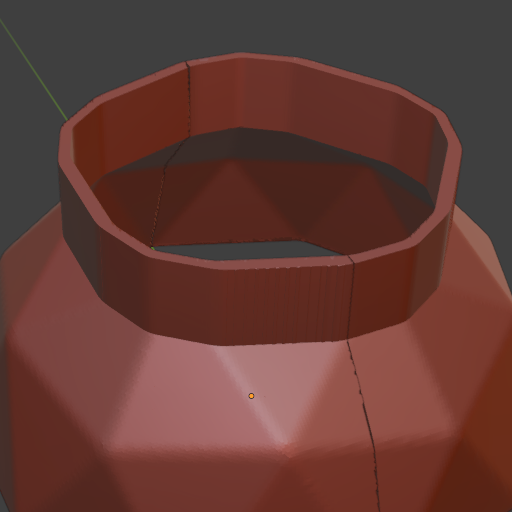

# Blender Mold Generator

A Blender add-on to generate mold shells from 3D models. This addon analyzes a mesh to find its thickest cross-section along the Z-axis, cuts it at that location, extrudes the profile to create a shell, and offers options for splitting the mold and working non-destructively.

Particularly useful when used on objects that already represent a shell, such like using Blenders Solidify modifier or the [Blender Shell Generator](https://github.com/Ruakij/blender-shell-generator) addon from me.

  
*Result of the Mold Generator addon: An extruded shell following the octagonal opening of the original 3D model shell.*  

## Features

- **Automatic Slice Analysis**: Finds the thickest (widest perimeter) Z-slice within a user-defined search depth from the top of the mesh.
- **Intelligent Cutting & Extrusion**: Cuts the mesh at the calculated Z-location and extrudes the resulting profile up to the original mesh's maximum height, creating a basic mold block.
- **Clean Boolean Operations**: Uses boolean modifiers for precise cutting operations.
- **Two-Part Mold Creation**: Optionally splits the generated mold shell into two halves along a chosen plane (YZ, XZ, or XY).
- **Manual Control**: Option to manually specify the Z-height for the cut.
- **Non-Destructive Workflow**: Option to perform operations on a duplicate of the selected mesh, preserving the original.
- **User-Friendly Interface**: Accessible via the 3D View Sidebar (N-Panel).

## Usage

1.  Select a mesh object in Object Mode. Ensure it's oriented correctly (intended "top" facing +Z).
2.  Access the Mold Generator through:
    - Sidebar panel: View3D > Sidebar (N-key) > Mold Generator tab
    - Object menu: Object > Generate Mold (after enabling)
    - Shortcut: Ctrl+Alt+M (Default)
3.  Adjust parameters in the panel as needed.
4.  Optionally click "Find Slice" to preview the calculated cut location.
5.  Click "Generate Mold" to create the mold shell.

## Parameters

### Workflow
- **Work on Copy**: Duplicate the object before generating the mold.
- **Cut in Half**: Split the generated mold into two parts after extrusion.
  - **Cut Axis**: Choose the plane (YZ, XZ, XY) for splitting.

### Slice Analysis
- **Use Manual Slice**: Bypass automatic analysis and use manually entered values.
  - **Manual Cut Z**: Specify the exact Z-height for the cut.
  - **Manual Perimeter**: (Informational) Manually specify the perimeter if needed (primarily for reference when using manual Z).
- **Search Depth**: (Automatic Mode) How far down from the mesh top (max Z) to search for the thickest slice.
- **Find Slice Button**: (Automatic Mode) Runs the analysis and updates 'Cut Z' and 'Perimeter' fields.
- **Cut Z (Output)**: Displays the Z-location found by the analysis or set manually.
- **Perimeter (Output)**: Displays the approximate perimeter found by the analysis or set manually.

### Addon Preferences (Edit > Preferences > Add-ons > Mold Generator)
- **Default Search Depth**: Set the default value for the 'Search Depth' parameter.
- **Keep Intermediates**: Prevent deletion of temporary objects (cutting planes) used during generation, useful for debugging.

## Tips and Known Issues

- **Mesh Orientation**: Ensure your model is oriented correctly with the desired "parting line" generally parallel to the XY plane for best results from the Z-slice analysis.
- **Watertight Meshes**: Boolean operations work best on clean, manifold (watertight) meshes. Issues may arise with non-manifold geometry.
- **Complex Geometry**: Very complex meshes might lead to long processing times or boolean failures. Consider simplifying the mesh if issues occur.
- **Manual Slice**: If automatic detection doesn't yield the desired cut location, use the "Use Manual Slice" option for precise control.

## Development

The addon uses a modular structure:
- `__init__.py`: Addon registration, metadata, keymap setup.
- `modules/core.py`: Core mold generation logic (slice finding, cutting, extrusion, splitting).
- `modules/operators.py`: Blender operators (`Find Slice`, `Generate Mold`).
- `modules/properties.py`: Property definitions (for UI panel and preferences).
- `modules/ui.py`: UI Panel layout and menu integration.
- `modules/utils.py`: Utility functions (e.g., error reporting).

## License

This project is licensed under the GPLv3 License - see the LICENSE file for details.
